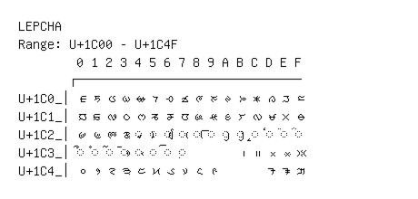

# Lepcha

**Range:** `U+1C00` - `U+1C4F`

[← Back to Index](../README.md)

```text
        0 1 2 3 4 5 6 7 8 9 A B C D E F
       ┌───────────────────────────────
U+1C0_│ᰀ ᰁ ᰂ ᰃ ᰄ ᰅ ᰆ ᰇ ᰈ ᰉ ᰊ ᰋ ᰌ ᰍ ᰎ ᰏ
U+1C1_│ᰐ ᰑ ᰒ ᰓ ᰔ ᰕ ᰖ ᰗ ᰘ ᰙ ᰚ ᰛ ᰜ ᰝ ᰞ ᰟ
U+1C2_│ᰠ ᰡ ᰢ ᰣ ◌ᰤ ◌ᰥ ◌ᰦ ◌ᰧ ◌ᰨ ◌ᰩ ◌ᰪ ◌ᰫ ◌ᰬ ◌ᰭ ◌ᰮ ◌ᰯ
U+1C3_│◌ᰰ ◌ᰱ ◌ᰲ ◌ᰳ ◌ᰴ ◌ᰵ ◌ᰶ ◌᰷       ᰻ ᰼ ᰽ ᰾ ᰿
U+1C4_│᱀ ᱁ ᱂ ᱃ ᱄ ᱅ ᱆ ᱇ ᱈ ᱉       ᱍ ᱎ ᱏ
```

## Visual Fallback Reference
If your system lacks the required fonts to render these characters properly, use the image below as a visual guide.


