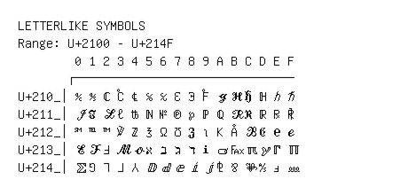

# Letterlike Symbols

**Range:** `U+2100` - `U+214F`

[← Back to Index](../README.md)

```text
        0 1 2 3 4 5 6 7 8 9 A B C D E F
       ┌───────────────────────────────
U+210_│℀ ℁ ℂ ℃ ℄ ℅ ℆ ℇ ℈ ℉ ℊ ℋ ℌ ℍ ℎ ℏ
U+211_│ℐ ℑ ℒ ℓ ℔ ℕ № ℗ ℘ ℙ ℚ ℛ ℜ ℝ ℞ ℟
U+212_│℠ ℡ ™ ℣ ℤ ℥ Ω ℧ ℨ ℩ K Å ℬ ℭ ℮ ℯ
U+213_│ℰ ℱ Ⅎ ℳ ℴ ℵ ℶ ℷ ℸ ℹ ℺ ℻ ℼ ℽ ℾ ℿ
U+214_│⅀ ⅁ ⅂ ⅃ ⅄ ⅅ ⅆ ⅇ ⅈ ⅉ ⅊ ⅋ ⅌ ⅍ ⅎ ⅏
```

## Visual Fallback Reference
If your system lacks the required fonts to render these characters properly, use the image below as a visual guide.


