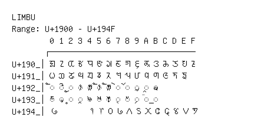

# Limbu

**Range:** `U+1900` - `U+194F`

[← Back to Index](../README.md)

```text
        0 1 2 3 4 5 6 7 8 9 A B C D E F
       ┌───────────────────────────────
U+190_│ᤀ ᤁ ᤂ ᤃ ᤄ ᤅ ᤆ ᤇ ᤈ ᤉ ᤊ ᤋ ᤌ ᤍ ᤎ ᤏ
U+191_│ᤐ ᤑ ᤒ ᤓ ᤔ ᤕ ᤖ ᤗ ᤘ ᤙ ᤚ ᤛ ᤜ ᤝ ᤞ
U+192_│◌ᤠ ◌ᤡ ◌ᤢ ◌ᤣ ◌ᤤ ◌ᤥ ◌ᤦ ◌ᤧ ◌ᤨ ◌ᤩ ◌ᤪ ◌ᤫ
U+193_│◌ᤰ ◌ᤱ ◌ᤲ ◌ᤳ ◌ᤴ ◌ᤵ ◌ᤶ ◌ᤷ ◌ᤸ ◌᤹ ◌᤺ ◌᤻
U+194_│᥀       ᥄ ᥅ ᥆ ᥇ ᥈ ᥉ ᥊ ᥋ ᥌ ᥍ ᥎ ᥏
```

## Visual Fallback Reference
If your system lacks the required fonts to render these characters properly, use the image below as a visual guide.


