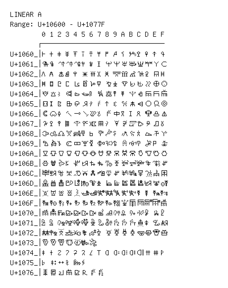

# Linear A

**Range:** `U+10600` - `U+1077F`

[← Back to Index](../README.md)

```text
        0 1 2 3 4 5 6 7 8 9 A B C D E F
       ┌───────────────────────────────
U+1060_│𐘀 𐘁 𐘂 𐘃 𐘄 𐘅 𐘆 𐘇 𐘈 𐘉 𐘊 𐘋 𐘌 𐘍 𐘎 𐘏
U+1061_│𐘐 𐘑 𐘒 𐘓 𐘔 𐘕 𐘖 𐘗 𐘘 𐘙 𐘚 𐘛 𐘜 𐘝 𐘞 𐘟
U+1062_│𐘠 𐘡 𐘢 𐘣 𐘤 𐘥 𐘦 𐘧 𐘨 𐘩 𐘪 𐘫 𐘬 𐘭 𐘮 𐘯
U+1063_│𐘰 𐘱 𐘲 𐘳 𐘴 𐘵 𐘶 𐘷 𐘸 𐘹 𐘺 𐘻 𐘼 𐘽 𐘾 𐘿
U+1064_│𐙀 𐙁 𐙂 𐙃 𐙄 𐙅 𐙆 𐙇 𐙈 𐙉 𐙊 𐙋 𐙌 𐙍 𐙎 𐙏
U+1065_│𐙐 𐙑 𐙒 𐙓 𐙔 𐙕 𐙖 𐙗 𐙘 𐙙 𐙚 𐙛 𐙜 𐙝 𐙞 𐙟
U+1066_│𐙠 𐙡 𐙢 𐙣 𐙤 𐙥 𐙦 𐙧 𐙨 𐙩 𐙪 𐙫 𐙬 𐙭 𐙮 𐙯
U+1067_│𐙰 𐙱 𐙲 𐙳 𐙴 𐙵 𐙶 𐙷 𐙸 𐙹 𐙺 𐙻 𐙼 𐙽 𐙾 𐙿
U+1068_│𐚀 𐚁 𐚂 𐚃 𐚄 𐚅 𐚆 𐚇 𐚈 𐚉 𐚊 𐚋 𐚌 𐚍 𐚎 𐚏
U+1069_│𐚐 𐚑 𐚒 𐚓 𐚔 𐚕 𐚖 𐚗 𐚘 𐚙 𐚚 𐚛 𐚜 𐚝 𐚞 𐚟
U+106A_│𐚠 𐚡 𐚢 𐚣 𐚤 𐚥 𐚦 𐚧 𐚨 𐚩 𐚪 𐚫 𐚬 𐚭 𐚮 𐚯
U+106B_│𐚰 𐚱 𐚲 𐚳 𐚴 𐚵 𐚶 𐚷 𐚸 𐚹 𐚺 𐚻 𐚼 𐚽 𐚾 𐚿
U+106C_│𐛀 𐛁 𐛂 𐛃 𐛄 𐛅 𐛆 𐛇 𐛈 𐛉 𐛊 𐛋 𐛌 𐛍 𐛎 𐛏
U+106D_│𐛐 𐛑 𐛒 𐛓 𐛔 𐛕 𐛖 𐛗 𐛘 𐛙 𐛚 𐛛 𐛜 𐛝 𐛞 𐛟
U+106E_│𐛠 𐛡 𐛢 𐛣 𐛤 𐛥 𐛦 𐛧 𐛨 𐛩 𐛪 𐛫 𐛬 𐛭 𐛮 𐛯
U+106F_│𐛰 𐛱 𐛲 𐛳 𐛴 𐛵 𐛶 𐛷 𐛸 𐛹 𐛺 𐛻 𐛼 𐛽 𐛾 𐛿
U+1070_│𐜀 𐜁 𐜂 𐜃 𐜄 𐜅 𐜆 𐜇 𐜈 𐜉 𐜊 𐜋 𐜌 𐜍 𐜎 𐜏
U+1071_│𐜐 𐜑 𐜒 𐜓 𐜔 𐜕 𐜖 𐜗 𐜘 𐜙 𐜚 𐜛 𐜜 𐜝 𐜞 𐜟
U+1072_│𐜠 𐜡 𐜢 𐜣 𐜤 𐜥 𐜦 𐜧 𐜨 𐜩 𐜪 𐜫 𐜬 𐜭 𐜮 𐜯
U+1073_│𐜰 𐜱 𐜲 𐜳 𐜴 𐜵 𐜶
U+1074_│𐝀 𐝁 𐝂 𐝃 𐝄 𐝅 𐝆 𐝇 𐝈 𐝉 𐝊 𐝋 𐝌 𐝍 𐝎 𐝏
U+1075_│𐝐 𐝑 𐝒 𐝓 𐝔 𐝕
U+1076_│𐝠 𐝡 𐝢 𐝣 𐝤 𐝥 𐝦 𐝧
```

## Visual Fallback Reference
If your system lacks the required fonts to render these characters properly, use the image below as a visual guide.


