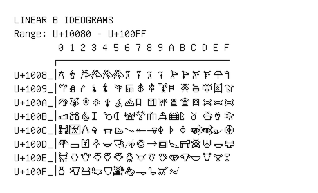

# Linear B Ideograms

**Range:** `U+10080` - `U+100FF`

[← Back to Index](../README.md)

```text
        0 1 2 3 4 5 6 7 8 9 A B C D E F
       ┌───────────────────────────────
U+1008_│𐂀 𐂁 𐂂 𐂃 𐂄 𐂅 𐂆 𐂇 𐂈 𐂉 𐂊 𐂋 𐂌 𐂍 𐂎 𐂏
U+1009_│𐂐 𐂑 𐂒 𐂓 𐂔 𐂕 𐂖 𐂗 𐂘 𐂙 𐂚 𐂛 𐂜 𐂝 𐂞 𐂟
U+100A_│𐂠 𐂡 𐂢 𐂣 𐂤 𐂥 𐂦 𐂧 𐂨 𐂩 𐂪 𐂫 𐂬 𐂭 𐂮 𐂯
U+100B_│𐂰 𐂱 𐂲 𐂳 𐂴 𐂵 𐂶 𐂷 𐂸 𐂹 𐂺 𐂻 𐂼 𐂽 𐂾 𐂿
U+100C_│𐃀 𐃁 𐃂 𐃃 𐃄 𐃅 𐃆 𐃇 𐃈 𐃉 𐃊 𐃋 𐃌 𐃍 𐃎 𐃏
U+100D_│𐃐 𐃑 𐃒 𐃓 𐃔 𐃕 𐃖 𐃗 𐃘 𐃙 𐃚 𐃛 𐃜 𐃝 𐃞 𐃟
U+100E_│𐃠 𐃡 𐃢 𐃣 𐃤 𐃥 𐃦 𐃧 𐃨 𐃩 𐃪 𐃫 𐃬 𐃭 𐃮 𐃯
U+100F_│𐃰 𐃱 𐃲 𐃳 𐃴 𐃵 𐃶 𐃷 𐃸 𐃹 𐃺
```

## Visual Fallback Reference
If your system lacks the required fonts to render these characters properly, use the image below as a visual guide.


