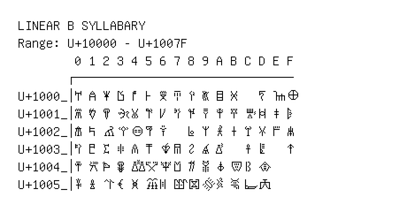

# Linear B Syllabary

**Range:** `U+10000` - `U+1007F`

[← Back to Index](../README.md)

```text
        0 1 2 3 4 5 6 7 8 9 A B C D E F
       ┌───────────────────────────────
U+1000_│𐀀 𐀁 𐀂 𐀃 𐀄 𐀅 𐀆 𐀇 𐀈 𐀉 𐀊 𐀋   𐀍 𐀎 𐀏
U+1001_│𐀐 𐀑 𐀒 𐀓 𐀔 𐀕 𐀖 𐀗 𐀘 𐀙 𐀚 𐀛 𐀜 𐀝 𐀞 𐀟
U+1002_│𐀠 𐀡 𐀢 𐀣 𐀤 𐀥 𐀦   𐀨 𐀩 𐀪 𐀫 𐀬 𐀭 𐀮 𐀯
U+1003_│𐀰 𐀱 𐀲 𐀳 𐀴 𐀵 𐀶 𐀷 𐀸 𐀹 𐀺   𐀼 𐀽   𐀿
U+1004_│𐁀 𐁁 𐁂 𐁃 𐁄 𐁅 𐁆 𐁇 𐁈 𐁉 𐁊 𐁋 𐁌 𐁍
U+1005_│𐁐 𐁑 𐁒 𐁓 𐁔 𐁕 𐁖 𐁗 𐁘 𐁙 𐁚 𐁛 𐁜 𐁝
```

## Visual Fallback Reference
If your system lacks the required fonts to render these characters properly, use the image below as a visual guide.


