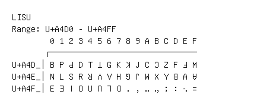

# Lisu

**Range:** `U+A4D0` - `U+A4FF`

[← Back to Index](../README.md)

```text
        0 1 2 3 4 5 6 7 8 9 A B C D E F
       ┌───────────────────────────────
U+A4D_│ꓐ ꓑ ꓒ ꓓ ꓔ ꓕ ꓖ ꓗ ꓘ ꓙ ꓚ ꓛ ꓜ ꓝ ꓞ ꓟ
U+A4E_│ꓠ ꓡ ꓢ ꓣ ꓤ ꓥ ꓦ ꓧ ꓨ ꓩ ꓪ ꓫ ꓬ ꓭ ꓮ ꓯ
U+A4F_│ꓰ ꓱ ꓲ ꓳ ꓴ ꓵ ꓶ ꓷ ꓸ ꓹ ꓺ ꓻ ꓼ ꓽ ꓾ ꓿
```

## Visual Fallback Reference
If your system lacks the required fonts to render these characters properly, use the image below as a visual guide.


