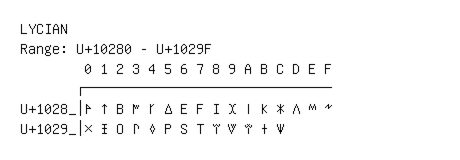

# Lycian

**Range:** `U+10280` - `U+1029F`

[← Back to Index](../README.md)

```text
        0 1 2 3 4 5 6 7 8 9 A B C D E F
       ┌───────────────────────────────
U+1028_│𐊀 𐊁 𐊂 𐊃 𐊄 𐊅 𐊆 𐊇 𐊈 𐊉 𐊊 𐊋 𐊌 𐊍 𐊎 𐊏
U+1029_│𐊐 𐊑 𐊒 𐊓 𐊔 𐊕 𐊖 𐊗 𐊘 𐊙 𐊚 𐊛 𐊜
```

## Visual Fallback Reference
If your system lacks the required fonts to render these characters properly, use the image below as a visual guide.


