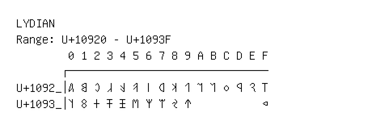

# Lydian

**Range:** `U+10920` - `U+1093F`

[← Back to Index](../README.md)

```text
        0 1 2 3 4 5 6 7 8 9 A B C D E F
       ┌───────────────────────────────
U+1092_│𐤠 𐤡 𐤢 𐤣 𐤤 𐤥 𐤦 𐤧 𐤨 𐤩 𐤪 𐤫 𐤬 𐤭 𐤮 𐤯
U+1093_│𐤰 𐤱 𐤲 𐤳 𐤴 𐤵 𐤶 𐤷 𐤸 𐤹           𐤿
```

## Visual Fallback Reference
If your system lacks the required fonts to render these characters properly, use the image below as a visual guide.


