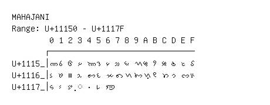

# Mahajani

**Range:** `U+11150` - `U+1117F`

[← Back to Index](../README.md)

```text
        0 1 2 3 4 5 6 7 8 9 A B C D E F
       ┌───────────────────────────────
U+1115_│𑅐 𑅑 𑅒 𑅓 𑅔 𑅕 𑅖 𑅗 𑅘 𑅙 𑅚 𑅛 𑅜 𑅝 𑅞 𑅟
U+1116_│𑅠 𑅡 𑅢 𑅣 𑅤 𑅥 𑅦 𑅧 𑅨 𑅩 𑅪 𑅫 𑅬 𑅭 𑅮 𑅯
U+1117_│𑅰 𑅱 𑅲 ◌𑅳 𑅴 𑅵 𑅶
```

## Visual Fallback Reference
If your system lacks the required fonts to render these characters properly, use the image below as a visual guide.


