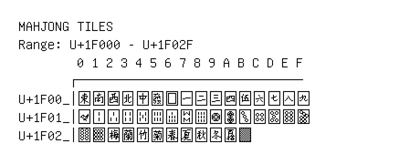

# Mahjong Tiles

**Range:** `U+1F000` - `U+1F02F`

[← Back to Index](../README.md)

```text
        0 1 2 3 4 5 6 7 8 9 A B C D E F
       ┌───────────────────────────────
U+1F00_│🀀 🀁 🀂 🀃 🀄🀅 🀆 🀇 🀈 🀉 🀊 🀋 🀌 🀍 🀎 🀏
U+1F01_│🀐 🀑 🀒 🀓 🀔 🀕 🀖 🀗 🀘 🀙 🀚 🀛 🀜 🀝 🀞 🀟
U+1F02_│🀠 🀡 🀢 🀣 🀤 🀥 🀦 🀧 🀨 🀩 🀪 🀫
```

## Visual Fallback Reference
If your system lacks the required fonts to render these characters properly, use the image below as a visual guide.


