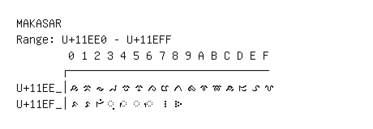

# Makasar

**Range:** `U+11EE0` - `U+11EFF`

[← Back to Index](../README.md)

```text
        0 1 2 3 4 5 6 7 8 9 A B C D E F
       ┌───────────────────────────────
U+11EE_│𑻠 𑻡 𑻢 𑻣 𑻤 𑻥 𑻦 𑻧 𑻨 𑻩 𑻪 𑻫 𑻬 𑻭 𑻮 𑻯
U+11EF_│𑻰 𑻱 𑻲 ◌𑻳 ◌𑻴 ◌𑻵 ◌𑻶 𑻷 𑻸
```

## Visual Fallback Reference
If your system lacks the required fonts to render these characters properly, use the image below as a visual guide.


