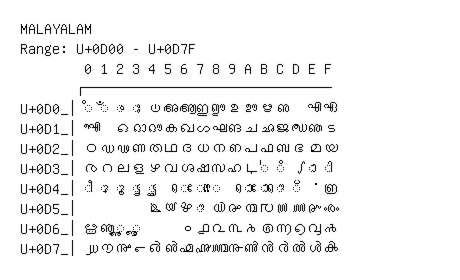

# Malayalam

**Range:** `U+0D00` - `U+0D7F`

[← Back to Index](../README.md)

```text
        0 1 2 3 4 5 6 7 8 9 A B C D E F
       ┌───────────────────────────────
U+0D0_│◌ഀ ◌ഁ ◌ം ◌ഃ ഄ അ ആ ഇ ഈ ഉ ഊ ഋ ഌ   എ ഏ
U+0D1_│ഐ   ഒ ഓ ഔ ക ഖ ഗ ഘ ങ ച ഛ ജ ഝ ഞ ട
U+0D2_│ഠ ഡ ഢ ണ ത ഥ ദ ധ ന ഩ പ ഫ ബ ഭ മ യ
U+0D3_│ര റ ല ള ഴ വ ശ ഷ സ ഹ ഺ ◌഻ ◌഼ ഽ ◌ാ ◌ി
U+0D4_│◌ീ ◌ു ◌ൂ ◌ൃ ◌ൄ   ◌െ ◌േ ◌ൈ   ◌ൊ ◌ോ ◌ൌ ◌് ൎ ൏
U+0D5_│        ൔ ൕ ൖ ◌ൗ ൘ ൙ ൚ ൛ ൜ ൝ ൞ ൟ
U+0D6_│ൠ ൡ ◌ൢ ◌ൣ     ൦ ൧ ൨ ൩ ൪ ൫ ൬ ൭ ൮ ൯
U+0D7_│൰ ൱ ൲ ൳ ൴ ൵ ൶ ൷ ൸ ൹ ൺ ൻ ർ ൽ ൾ ൿ
```

## Visual Fallback Reference
If your system lacks the required fonts to render these characters properly, use the image below as a visual guide.


