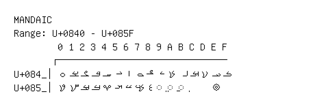

# Mandaic

**Range:** `U+0840` - `U+085F`

[← Back to Index](../README.md)

```text
        0 1 2 3 4 5 6 7 8 9 A B C D E F
       ┌───────────────────────────────
U+084_│ࡀ ࡁ ࡂ ࡃ ࡄ ࡅ ࡆ ࡇ ࡈ ࡉ ࡊ ࡋ ࡌ ࡍ ࡎ ࡏ
U+085_│ࡐ ࡑ ࡒ ࡓ ࡔ ࡕ ࡖ ࡗ ࡘ ◌࡙ ◌࡚ ◌࡛     ࡞
```

## Visual Fallback Reference
If your system lacks the required fonts to render these characters properly, use the image below as a visual guide.


