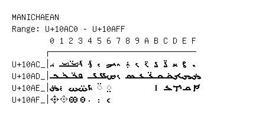

# Manichaean

**Range:** `U+10AC0` - `U+10AFF`

[← Back to Index](../README.md)

```text
        0 1 2 3 4 5 6 7 8 9 A B C D E F
       ┌───────────────────────────────
U+10AC_│𐫀 𐫁 𐫂 𐫃 𐫄 𐫅 𐫆 𐫇 𐫈 𐫉 𐫊 𐫋 𐫌 𐫍 𐫎 𐫏
U+10AD_│𐫐 𐫑 𐫒 𐫓 𐫔 𐫕 𐫖 𐫗 𐫘 𐫙 𐫚 𐫛 𐫜 𐫝 𐫞 𐫟
U+10AE_│𐫠 𐫡 𐫢 𐫣 𐫤 ◌𐫥 ◌𐫦         𐫫 𐫬 𐫭 𐫮 𐫯
U+10AF_│𐫰 𐫱 𐫲 𐫳 𐫴 𐫵 𐫶
```

## Visual Fallback Reference
If your system lacks the required fonts to render these characters properly, use the image below as a visual guide.


