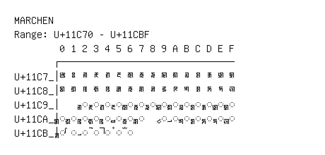

# Marchen

**Range:** `U+11C70` - `U+11CBF`

[← Back to Index](../README.md)

```text
        0 1 2 3 4 5 6 7 8 9 A B C D E F
       ┌───────────────────────────────
U+11C7_│𑱰 𑱱 𑱲 𑱳 𑱴 𑱵 𑱶 𑱷 𑱸 𑱹 𑱺 𑱻 𑱼 𑱽 𑱾 𑱿
U+11C8_│𑲀 𑲁 𑲂 𑲃 𑲄 𑲅 𑲆 𑲇 𑲈 𑲉 𑲊 𑲋 𑲌 𑲍 𑲎 𑲏
U+11C9_│    ◌𑲒 ◌𑲓 ◌𑲔 ◌𑲕 ◌𑲖 ◌𑲗 ◌𑲘 ◌𑲙 ◌𑲚 ◌𑲛 ◌𑲜 ◌𑲝 ◌𑲞 ◌𑲟
U+11CA_│◌𑲠 ◌𑲡 ◌𑲢 ◌𑲣 ◌𑲤 ◌𑲥 ◌𑲦 ◌𑲧   ◌𑲩 ◌𑲪 ◌𑲫 ◌𑲬 ◌𑲭 ◌𑲮 ◌𑲯
U+11CB_│◌𑲰 ◌𑲱 ◌𑲲 ◌𑲳 ◌𑲴 ◌𑲵 ◌𑲶
```

## Visual Fallback Reference
If your system lacks the required fonts to render these characters properly, use the image below as a visual guide.


