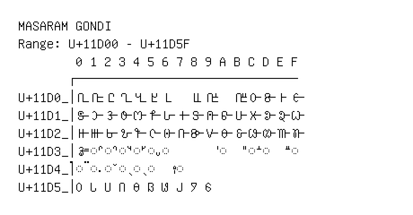

# Masaram Gondi

**Range:** `U+11D00` - `U+11D5F`

[← Back to Index](../README.md)

```text
        0 1 2 3 4 5 6 7 8 9 A B C D E F
       ┌───────────────────────────────
U+11D0_│𑴀 𑴁 𑴂 𑴃 𑴄 𑴅 𑴆   𑴈 𑴉   𑴋 𑴌 𑴍 𑴎 𑴏
U+11D1_│𑴐 𑴑 𑴒 𑴓 𑴔 𑴕 𑴖 𑴗 𑴘 𑴙 𑴚 𑴛 𑴜 𑴝 𑴞 𑴟
U+11D2_│𑴠 𑴡 𑴢 𑴣 𑴤 𑴥 𑴦 𑴧 𑴨 𑴩 𑴪 𑴫 𑴬 𑴭 𑴮 𑴯
U+11D3_│𑴰 ◌𑴱 ◌𑴲 ◌𑴳 ◌𑴴 ◌𑴵 ◌𑴶       ◌𑴺   ◌𑴼 ◌𑴽   ◌𑴿
U+11D4_│◌𑵀 ◌𑵁 ◌𑵂 ◌𑵃 ◌𑵄 ◌𑵅 𑵆 ◌𑵇
U+11D5_│𑵐 𑵑 𑵒 𑵓 𑵔 𑵕 𑵖 𑵗 𑵘 𑵙
```

## Visual Fallback Reference
If your system lacks the required fonts to render these characters properly, use the image below as a visual guide.


