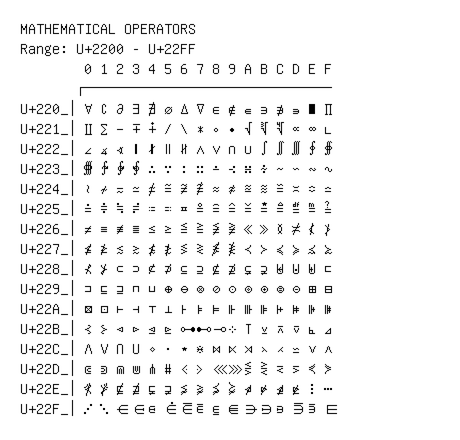

# Mathematical Operators

**Range:** `U+2200` - `U+22FF`

[← Back to Index](../README.md)

```text
        0 1 2 3 4 5 6 7 8 9 A B C D E F
       ┌───────────────────────────────
U+220_│∀ ∁ ∂ ∃ ∄ ∅ ∆ ∇ ∈ ∉ ∊ ∋ ∌ ∍ ∎ ∏
U+221_│∐ ∑ − ∓ ∔ ∕ ∖ ∗ ∘ ∙ √ ∛ ∜ ∝ ∞ ∟
U+222_│∠ ∡ ∢ ∣ ∤ ∥ ∦ ∧ ∨ ∩ ∪ ∫ ∬ ∭ ∮ ∯
U+223_│∰ ∱ ∲ ∳ ∴ ∵ ∶ ∷ ∸ ∹ ∺ ∻ ∼ ∽ ∾ ∿
U+224_│≀ ≁ ≂ ≃ ≄ ≅ ≆ ≇ ≈ ≉ ≊ ≋ ≌ ≍ ≎ ≏
U+225_│≐ ≑ ≒ ≓ ≔ ≕ ≖ ≗ ≘ ≙ ≚ ≛ ≜ ≝ ≞ ≟
U+226_│≠ ≡ ≢ ≣ ≤ ≥ ≦ ≧ ≨ ≩ ≪ ≫ ≬ ≭ ≮ ≯
U+227_│≰ ≱ ≲ ≳ ≴ ≵ ≶ ≷ ≸ ≹ ≺ ≻ ≼ ≽ ≾ ≿
U+228_│⊀ ⊁ ⊂ ⊃ ⊄ ⊅ ⊆ ⊇ ⊈ ⊉ ⊊ ⊋ ⊌ ⊍ ⊎ ⊏
U+229_│⊐ ⊑ ⊒ ⊓ ⊔ ⊕ ⊖ ⊗ ⊘ ⊙ ⊚ ⊛ ⊜ ⊝ ⊞ ⊟
U+22A_│⊠ ⊡ ⊢ ⊣ ⊤ ⊥ ⊦ ⊧ ⊨ ⊩ ⊪ ⊫ ⊬ ⊭ ⊮ ⊯
U+22B_│⊰ ⊱ ⊲ ⊳ ⊴ ⊵ ⊶ ⊷ ⊸ ⊹ ⊺ ⊻ ⊼ ⊽ ⊾ ⊿
U+22C_│⋀ ⋁ ⋂ ⋃ ⋄ ⋅ ⋆ ⋇ ⋈ ⋉ ⋊ ⋋ ⋌ ⋍ ⋎ ⋏
U+22D_│⋐ ⋑ ⋒ ⋓ ⋔ ⋕ ⋖ ⋗ ⋘ ⋙ ⋚ ⋛ ⋜ ⋝ ⋞ ⋟
U+22E_│⋠ ⋡ ⋢ ⋣ ⋤ ⋥ ⋦ ⋧ ⋨ ⋩ ⋪ ⋫ ⋬ ⋭ ⋮ ⋯
U+22F_│⋰ ⋱ ⋲ ⋳ ⋴ ⋵ ⋶ ⋷ ⋸ ⋹ ⋺ ⋻ ⋼ ⋽ ⋾ ⋿
```

## Visual Fallback Reference
If your system lacks the required fonts to render these characters properly, use the image below as a visual guide.


