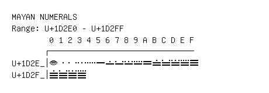

# Mayan Numerals

**Range:** `U+1D2E0` - `U+1D2FF`

[← Back to Index](../README.md)

```text
        0 1 2 3 4 5 6 7 8 9 A B C D E F
       ┌───────────────────────────────
U+1D2E_│𝋠 𝋡 𝋢 𝋣 𝋤 𝋥 𝋦 𝋧 𝋨 𝋩 𝋪 𝋫 𝋬 𝋭 𝋮 𝋯
U+1D2F_│𝋰 𝋱 𝋲 𝋳
```

## Visual Fallback Reference
If your system lacks the required fonts to render these characters properly, use the image below as a visual guide.


