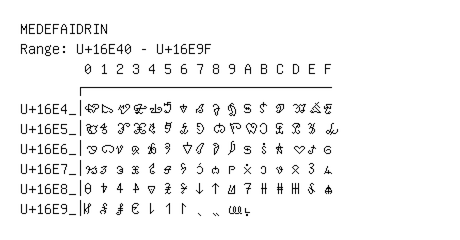

# Medefaidrin

**Range:** `U+16E40` - `U+16E9F`

[← Back to Index](../README.md)

```text
        0 1 2 3 4 5 6 7 8 9 A B C D E F
       ┌───────────────────────────────
U+16E4_│𖹀 𖹁 𖹂 𖹃 𖹄 𖹅 𖹆 𖹇 𖹈 𖹉 𖹊 𖹋 𖹌 𖹍 𖹎 𖹏
U+16E5_│𖹐 𖹑 𖹒 𖹓 𖹔 𖹕 𖹖 𖹗 𖹘 𖹙 𖹚 𖹛 𖹜 𖹝 𖹞 𖹟
U+16E6_│𖹠 𖹡 𖹢 𖹣 𖹤 𖹥 𖹦 𖹧 𖹨 𖹩 𖹪 𖹫 𖹬 𖹭 𖹮 𖹯
U+16E7_│𖹰 𖹱 𖹲 𖹳 𖹴 𖹵 𖹶 𖹷 𖹸 𖹹 𖹺 𖹻 𖹼 𖹽 𖹾 𖹿
U+16E8_│𖺀 𖺁 𖺂 𖺃 𖺄 𖺅 𖺆 𖺇 𖺈 𖺉 𖺊 𖺋 𖺌 𖺍 𖺎 𖺏
U+16E9_│𖺐 𖺑 𖺒 𖺓 𖺔 𖺕 𖺖 𖺗 𖺘 𖺙 𖺚
```

## Visual Fallback Reference
If your system lacks the required fonts to render these characters properly, use the image below as a visual guide.


