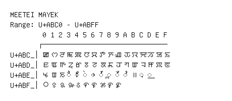

# Meetei Mayek

**Range:** `U+ABC0` - `U+ABFF`

[← Back to Index](../README.md)

```text
        0 1 2 3 4 5 6 7 8 9 A B C D E F
       ┌───────────────────────────────
U+ABC_│ꯀ ꯁ ꯂ ꯃ ꯄ ꯅ ꯆ ꯇ ꯈ ꯉ ꯊ ꯋ ꯌ ꯍ ꯎ ꯏ
U+ABD_│ꯐ ꯑ ꯒ ꯓ ꯔ ꯕ ꯖ ꯗ ꯘ ꯙ ꯚ ꯛ ꯜ ꯝ ꯞ ꯟ
U+ABE_│ꯠ ꯡ ꯢ ◌ꯣ ◌ꯤ ◌ꯥ ◌ꯦ ◌ꯧ ◌ꯨ ◌ꯩ ◌ꯪ ꯫ ◌꯬ ◌꯭
U+ABF_│꯰ ꯱ ꯲ ꯳ ꯴ ꯵ ꯶ ꯷ ꯸ ꯹
```

## Visual Fallback Reference
If your system lacks the required fonts to render these characters properly, use the image below as a visual guide.


