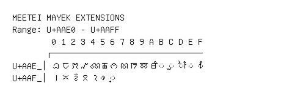

# Meetei Mayek Extensions

**Range:** `U+AAE0` - `U+AAFF`

[← Back to Index](../README.md)

```text
        0 1 2 3 4 5 6 7 8 9 A B C D E F
       ┌───────────────────────────────
U+AAE_│ꫠ ꫡ ꫢ ꫣ ꫤ ꫥ ꫦ ꫧ ꫨ ꫩ ꫪ ◌ꫫ ◌ꫬ ◌ꫭ ◌ꫮ ◌ꫯ
U+AAF_│꫰ ꫱ ꫲ ꫳ ꫴ ◌ꫵ ◌꫶
```

## Visual Fallback Reference
If your system lacks the required fonts to render these characters properly, use the image below as a visual guide.


