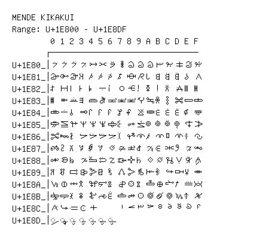

# Mende Kikakui

**Range:** `U+1E800` - `U+1E8DF`

[← Back to Index](../README.md)

```text
        0 1 2 3 4 5 6 7 8 9 A B C D E F
       ┌───────────────────────────────
U+1E80_│𞠀 𞠁 𞠂 𞠃 𞠄 𞠅 𞠆 𞠇 𞠈 𞠉 𞠊 𞠋 𞠌 𞠍 𞠎 𞠏
U+1E81_│𞠐 𞠑 𞠒 𞠓 𞠔 𞠕 𞠖 𞠗 𞠘 𞠙 𞠚 𞠛 𞠜 𞠝 𞠞 𞠟
U+1E82_│𞠠 𞠡 𞠢 𞠣 𞠤 𞠥 𞠦 𞠧 𞠨 𞠩 𞠪 𞠫 𞠬 𞠭 𞠮 𞠯
U+1E83_│𞠰 𞠱 𞠲 𞠳 𞠴 𞠵 𞠶 𞠷 𞠸 𞠹 𞠺 𞠻 𞠼 𞠽 𞠾 𞠿
U+1E84_│𞡀 𞡁 𞡂 𞡃 𞡄 𞡅 𞡆 𞡇 𞡈 𞡉 𞡊 𞡋 𞡌 𞡍 𞡎 𞡏
U+1E85_│𞡐 𞡑 𞡒 𞡓 𞡔 𞡕 𞡖 𞡗 𞡘 𞡙 𞡚 𞡛 𞡜 𞡝 𞡞 𞡟
U+1E86_│𞡠 𞡡 𞡢 𞡣 𞡤 𞡥 𞡦 𞡧 𞡨 𞡩 𞡪 𞡫 𞡬 𞡭 𞡮 𞡯
U+1E87_│𞡰 𞡱 𞡲 𞡳 𞡴 𞡵 𞡶 𞡷 𞡸 𞡹 𞡺 𞡻 𞡼 𞡽 𞡾 𞡿
U+1E88_│𞢀 𞢁 𞢂 𞢃 𞢄 𞢅 𞢆 𞢇 𞢈 𞢉 𞢊 𞢋 𞢌 𞢍 𞢎 𞢏
U+1E89_│𞢐 𞢑 𞢒 𞢓 𞢔 𞢕 𞢖 𞢗 𞢘 𞢙 𞢚 𞢛 𞢜 𞢝 𞢞 𞢟
U+1E8A_│𞢠 𞢡 𞢢 𞢣 𞢤 𞢥 𞢦 𞢧 𞢨 𞢩 𞢪 𞢫 𞢬 𞢭 𞢮 𞢯
U+1E8B_│𞢰 𞢱 𞢲 𞢳 𞢴 𞢵 𞢶 𞢷 𞢸 𞢹 𞢺 𞢻 𞢼 𞢽 𞢾 𞢿
U+1E8C_│𞣀 𞣁 𞣂 𞣃 𞣄     𞣇 𞣈 𞣉 𞣊 𞣋 𞣌 𞣍 𞣎 𞣏
U+1E8D_│◌𞣐 ◌𞣑 ◌𞣒 ◌𞣓 ◌𞣔 ◌𞣕 ◌𞣖
```

## Visual Fallback Reference
If your system lacks the required fonts to render these characters properly, use the image below as a visual guide.


