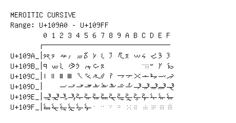

# Meroitic Cursive

**Range:** `U+109A0` - `U+109FF`

[← Back to Index](../README.md)

```text
        0 1 2 3 4 5 6 7 8 9 A B C D E F
       ┌───────────────────────────────
U+109A_│𐦠 𐦡 𐦢 𐦣 𐦤 𐦥 𐦦 𐦧 𐦨 𐦩 𐦪 𐦫 𐦬 𐦭 𐦮 𐦯
U+109B_│𐦰 𐦱 𐦲 𐦳 𐦴 𐦵 𐦶 𐦷         𐦼 𐦽 𐦾 𐦿
U+109C_│𐧀 𐧁 𐧂 𐧃 𐧄 𐧅 𐧆 𐧇 𐧈 𐧉 𐧊 𐧋 𐧌 𐧍 𐧎 𐧏
U+109D_│    𐧒 𐧓 𐧔 𐧕 𐧖 𐧗 𐧘 𐧙 𐧚 𐧛 𐧜 𐧝 𐧞 𐧟
U+109E_│𐧠 𐧡 𐧢 𐧣 𐧤 𐧥 𐧦 𐧧 𐧨 𐧩 𐧪 𐧫 𐧬 𐧭 𐧮 𐧯
U+109F_│𐧰 𐧱 𐧲 𐧳 𐧴 𐧵 𐧶 𐧷 𐧸 𐧹 𐧺 𐧻 𐧼 𐧽 𐧾 𐧿
```

## Visual Fallback Reference
If your system lacks the required fonts to render these characters properly, use the image below as a visual guide.


