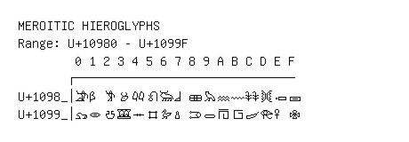

# Meroitic Hieroglyphs

**Range:** `U+10980` - `U+1099F`

[← Back to Index](../README.md)

```text
        0 1 2 3 4 5 6 7 8 9 A B C D E F
       ┌───────────────────────────────
U+1098_│𐦀 𐦁 𐦂 𐦃 𐦄 𐦅 𐦆 𐦇 𐦈 𐦉 𐦊 𐦋 𐦌 𐦍 𐦎 𐦏
U+1099_│𐦐 𐦑 𐦒 𐦓 𐦔 𐦕 𐦖 𐦗 𐦘 𐦙 𐦚 𐦛 𐦜 𐦝 𐦞 𐦟
```

## Visual Fallback Reference
If your system lacks the required fonts to render these characters properly, use the image below as a visual guide.


