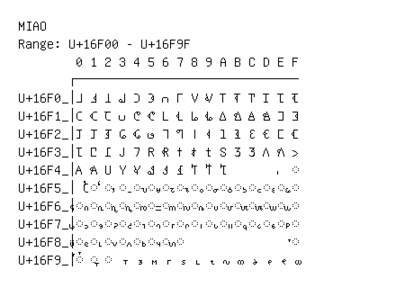

# Miao

**Range:** `U+16F00` - `U+16F9F`

[← Back to Index](../README.md)

```text
        0 1 2 3 4 5 6 7 8 9 A B C D E F
       ┌───────────────────────────────
U+16F0_│𖼀 𖼁 𖼂 𖼃 𖼄 𖼅 𖼆 𖼇 𖼈 𖼉 𖼊 𖼋 𖼌 𖼍 𖼎 𖼏
U+16F1_│𖼐 𖼑 𖼒 𖼓 𖼔 𖼕 𖼖 𖼗 𖼘 𖼙 𖼚 𖼛 𖼜 𖼝 𖼞 𖼟
U+16F2_│𖼠 𖼡 𖼢 𖼣 𖼤 𖼥 𖼦 𖼧 𖼨 𖼩 𖼪 𖼫 𖼬 𖼭 𖼮 𖼯
U+16F3_│𖼰 𖼱 𖼲 𖼳 𖼴 𖼵 𖼶 𖼷 𖼸 𖼹 𖼺 𖼻 𖼼 𖼽 𖼾 𖼿
U+16F4_│𖽀 𖽁 𖽂 𖽃 𖽄 𖽅 𖽆 𖽇 𖽈 𖽉 𖽊         ◌𖽏
U+16F5_│𖽐 ◌𖽑 ◌𖽒 ◌𖽓 ◌𖽔 ◌𖽕 ◌𖽖 ◌𖽗 ◌𖽘 ◌𖽙 ◌𖽚 ◌𖽛 ◌𖽜 ◌𖽝 ◌𖽞 ◌𖽟
U+16F6_│◌𖽠 ◌𖽡 ◌𖽢 ◌𖽣 ◌𖽤 ◌𖽥 ◌𖽦 ◌𖽧 ◌𖽨 ◌𖽩 ◌𖽪 ◌𖽫 ◌𖽬 ◌𖽭 ◌𖽮 ◌𖽯
U+16F7_│◌𖽰 ◌𖽱 ◌𖽲 ◌𖽳 ◌𖽴 ◌𖽵 ◌𖽶 ◌𖽷 ◌𖽸 ◌𖽹 ◌𖽺 ◌𖽻 ◌𖽼 ◌𖽽 ◌𖽾 ◌𖽿
U+16F8_│◌𖾀 ◌𖾁 ◌𖾂 ◌𖾃 ◌𖾄 ◌𖾅 ◌𖾆 ◌𖾇               ◌𖾏
U+16F9_│◌𖾐 ◌𖾑 ◌𖾒 𖾓 𖾔 𖾕 𖾖 𖾗 𖾘 𖾙 𖾚 𖾛 𖾜 𖾝 𖾞 𖾟
```

## Visual Fallback Reference
If your system lacks the required fonts to render these characters properly, use the image below as a visual guide.


