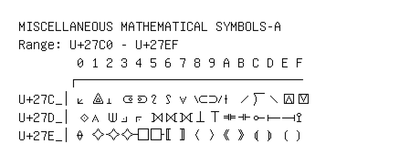

# Miscellaneous Mathematical Symbols-A

**Range:** `U+27C0` - `U+27EF`

[← Back to Index](../README.md)

```text
        0 1 2 3 4 5 6 7 8 9 A B C D E F
       ┌───────────────────────────────
U+27C_│⟀ ⟁ ⟂ ⟃ ⟄ ⟅ ⟆ ⟇ ⟈ ⟉ ⟊ ⟋ ⟌ ⟍ ⟎ ⟏
U+27D_│⟐ ⟑ ⟒ ⟓ ⟔ ⟕ ⟖ ⟗ ⟘ ⟙ ⟚ ⟛ ⟜ ⟝ ⟞ ⟟
U+27E_│⟠ ⟡ ⟢ ⟣ ⟤ ⟥ ⟦ ⟧ ⟨ ⟩ ⟪ ⟫ ⟬ ⟭ ⟮ ⟯
```

## Visual Fallback Reference
If your system lacks the required fonts to render these characters properly, use the image below as a visual guide.


