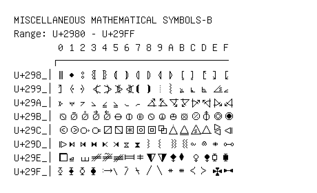

# Miscellaneous Mathematical Symbols-B

**Range:** `U+2980` - `U+29FF`

[← Back to Index](../README.md)

```text
        0 1 2 3 4 5 6 7 8 9 A B C D E F
       ┌───────────────────────────────
U+298_│⦀ ⦁ ⦂ ⦃ ⦄ ⦅ ⦆ ⦇ ⦈ ⦉ ⦊ ⦋ ⦌ ⦍ ⦎ ⦏
U+299_│⦐ ⦑ ⦒ ⦓ ⦔ ⦕ ⦖ ⦗ ⦘ ⦙ ⦚ ⦛ ⦜ ⦝ ⦞ ⦟
U+29A_│⦠ ⦡ ⦢ ⦣ ⦤ ⦥ ⦦ ⦧ ⦨ ⦩ ⦪ ⦫ ⦬ ⦭ ⦮ ⦯
U+29B_│⦰ ⦱ ⦲ ⦳ ⦴ ⦵ ⦶ ⦷ ⦸ ⦹ ⦺ ⦻ ⦼ ⦽ ⦾ ⦿
U+29C_│⧀ ⧁ ⧂ ⧃ ⧄ ⧅ ⧆ ⧇ ⧈ ⧉ ⧊ ⧋ ⧌ ⧍ ⧎ ⧏
U+29D_│⧐ ⧑ ⧒ ⧓ ⧔ ⧕ ⧖ ⧗ ⧘ ⧙ ⧚ ⧛ ⧜ ⧝ ⧞ ⧟
U+29E_│⧠ ⧡ ⧢ ⧣ ⧤ ⧥ ⧦ ⧧ ⧨ ⧩ ⧪ ⧫ ⧬ ⧭ ⧮ ⧯
U+29F_│⧰ ⧱ ⧲ ⧳ ⧴ ⧵ ⧶ ⧷ ⧸ ⧹ ⧺ ⧻ ⧼ ⧽ ⧾ ⧿
```

## Visual Fallback Reference
If your system lacks the required fonts to render these characters properly, use the image below as a visual guide.


