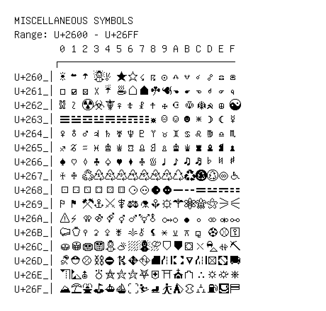

# Miscellaneous Symbols

**Range:** `U+2600` - `U+26FF`

[← Back to Index](../README.md)

```text
        0 1 2 3 4 5 6 7 8 9 A B C D E F
       ┌───────────────────────────────
U+260_│☀ ☁ ☂ ☃ ☄ ★ ☆ ☇ ☈ ☉ ☊ ☋ ☌ ☍ ☎ ☏
U+261_│☐ ☑ ☒ ☓ ☔☕☖ ☗ ☘ ☙ ☚ ☛ ☜ ☝ ☞ ☟
U+262_│☠ ☡ ☢ ☣ ☤ ☥ ☦ ☧ ☨ ☩ ☪ ☫ ☬ ☭ ☮ ☯
U+263_│☰ ☱ ☲ ☳ ☴ ☵ ☶ ☷ ☸ ☹ ☺ ☻ ☼ ☽ ☾ ☿
U+264_│♀ ♁ ♂ ♃ ♄ ♅ ♆ ♇ ♈♉♊♋♌♍♎♏
U+265_│♐♑♒♓♔ ♕ ♖ ♗ ♘ ♙ ♚ ♛ ♜ ♝ ♞ ♟
U+266_│♠ ♡ ♢ ♣ ♤ ♥ ♦ ♧ ♨ ♩ ♪ ♫ ♬ ♭ ♮ ♯
U+267_│♰ ♱ ♲ ♳ ♴ ♵ ♶ ♷ ♸ ♹ ♺ ♻ ♼ ♽ ♾ ♿
U+268_│⚀ ⚁ ⚂ ⚃ ⚄ ⚅ ⚆ ⚇ ⚈ ⚉ ⚊ ⚋ ⚌ ⚍ ⚎ ⚏
U+269_│⚐ ⚑ ⚒ ⚓⚔ ⚕ ⚖ ⚗ ⚘ ⚙ ⚚ ⚛ ⚜ ⚝ ⚞ ⚟
U+26A_│⚠ ⚡⚢ ⚣ ⚤ ⚥ ⚦ ⚧ ⚨ ⚩ ⚪⚫⚬ ⚭ ⚮ ⚯
U+26B_│⚰ ⚱ ⚲ ⚳ ⚴ ⚵ ⚶ ⚷ ⚸ ⚹ ⚺ ⚻ ⚼ ⚽⚾⚿
U+26C_│⛀ ⛁ ⛂ ⛃ ⛄⛅⛆ ⛇ ⛈ ⛉ ⛊ ⛋ ⛌ ⛍ ⛎⛏
U+26D_│⛐ ⛑ ⛒ ⛓ ⛔⛕ ⛖ ⛗ ⛘ ⛙ ⛚ ⛛ ⛜ ⛝ ⛞ ⛟
U+26E_│⛠ ⛡ ⛢ ⛣ ⛤ ⛥ ⛦ ⛧ ⛨ ⛩ ⛪⛫ ⛬ ⛭ ⛮ ⛯
U+26F_│⛰ ⛱ ⛲⛳⛴ ⛵⛶ ⛷ ⛸ ⛹ ⛺⛻ ⛼ ⛽⛾ ⛿
```

## Visual Fallback Reference
If your system lacks the required fonts to render these characters properly, use the image below as a visual guide.


