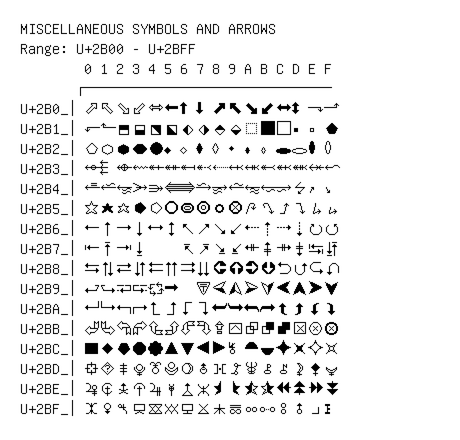

# Miscellaneous Symbols and Arrows

**Range:** `U+2B00` - `U+2BFF`

[← Back to Index](../README.md)

```text
        0 1 2 3 4 5 6 7 8 9 A B C D E F
       ┌───────────────────────────────
U+2B0_│⬀ ⬁ ⬂ ⬃ ⬄ ⬅ ⬆ ⬇ ⬈ ⬉ ⬊ ⬋ ⬌ ⬍ ⬎ ⬏
U+2B1_│⬐ ⬑ ⬒ ⬓ ⬔ ⬕ ⬖ ⬗ ⬘ ⬙ ⬚ ⬛⬜⬝ ⬞ ⬟
U+2B2_│⬠ ⬡ ⬢ ⬣ ⬤ ⬥ ⬦ ⬧ ⬨ ⬩ ⬪ ⬫ ⬬ ⬭ ⬮ ⬯
U+2B3_│⬰ ⬱ ⬲ ⬳ ⬴ ⬵ ⬶ ⬷ ⬸ ⬹ ⬺ ⬻ ⬼ ⬽ ⬾ ⬿
U+2B4_│⭀ ⭁ ⭂ ⭃ ⭄ ⭅ ⭆ ⭇ ⭈ ⭉ ⭊ ⭋ ⭌ ⭍ ⭎ ⭏
U+2B5_│⭐⭑ ⭒ ⭓ ⭔ ⭕⭖ ⭗ ⭘ ⭙ ⭚ ⭛ ⭜ ⭝ ⭞ ⭟
U+2B6_│⭠ ⭡ ⭢ ⭣ ⭤ ⭥ ⭦ ⭧ ⭨ ⭩ ⭪ ⭫ ⭬ ⭭ ⭮ ⭯
U+2B7_│⭰ ⭱ ⭲ ⭳     ⭶ ⭷ ⭸ ⭹ ⭺ ⭻ ⭼ ⭽ ⭾ ⭿
U+2B8_│⮀ ⮁ ⮂ ⮃ ⮄ ⮅ ⮆ ⮇ ⮈ ⮉ ⮊ ⮋ ⮌ ⮍ ⮎ ⮏
U+2B9_│⮐ ⮑ ⮒ ⮓ ⮔ ⮕   ⮗ ⮘ ⮙ ⮚ ⮛ ⮜ ⮝ ⮞ ⮟
U+2BA_│⮠ ⮡ ⮢ ⮣ ⮤ ⮥ ⮦ ⮧ ⮨ ⮩ ⮪ ⮫ ⮬ ⮭ ⮮ ⮯
U+2BB_│⮰ ⮱ ⮲ ⮳ ⮴ ⮵ ⮶ ⮷ ⮸ ⮹ ⮺ ⮻ ⮼ ⮽ ⮾ ⮿
U+2BC_│⯀ ⯁ ⯂ ⯃ ⯄ ⯅ ⯆ ⯇ ⯈ ⯉ ⯊ ⯋ ⯌ ⯍ ⯎ ⯏
U+2BD_│⯐ ⯑ ⯒ ⯓ ⯔ ⯕ ⯖ ⯗ ⯘ ⯙ ⯚ ⯛ ⯜ ⯝ ⯞ ⯟
U+2BE_│⯠ ⯡ ⯢ ⯣ ⯤ ⯥ ⯦ ⯧ ⯨ ⯩ ⯪ ⯫ ⯬ ⯭ ⯮ ⯯
U+2BF_│⯰ ⯱ ⯲ ⯳ ⯴ ⯵ ⯶ ⯷ ⯸ ⯹ ⯺ ⯻ ⯼ ⯽ ⯾ ⯿
```

## Visual Fallback Reference
If your system lacks the required fonts to render these characters properly, use the image below as a visual guide.


