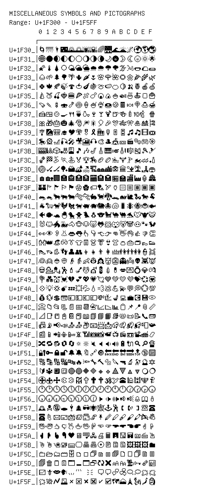

# Miscellaneous Symbols and Pictographs

**Range:** `U+1F300` - `U+1F5FF`

[← Back to Index](../README.md)

```text
        0 1 2 3 4 5 6 7 8 9 A B C D E F
       ┌───────────────────────────────
U+1F30_│🌀🌁🌂🌃🌄🌅🌆🌇🌈🌉🌊🌋🌌🌍🌎🌏
U+1F31_│🌐🌑🌒🌓🌔🌕🌖🌗🌘🌙🌚🌛🌜🌝🌞🌟
U+1F32_│🌠🌡 🌢 🌣 🌤 🌥 🌦 🌧 🌨 🌩 🌪 🌫 🌬 🌭🌮🌯
U+1F33_│🌰🌱🌲🌳🌴🌵🌶 🌷🌸🌹🌺🌻🌼🌽🌾🌿
U+1F34_│🍀🍁🍂🍃🍄🍅🍆🍇🍈🍉🍊🍋🍌🍍🍎🍏
U+1F35_│🍐🍑🍒🍓🍔🍕🍖🍗🍘🍙🍚🍛🍜🍝🍞🍟
U+1F36_│🍠🍡🍢🍣🍤🍥🍦🍧🍨🍩🍪🍫🍬🍭🍮🍯
U+1F37_│🍰🍱🍲🍳🍴🍵🍶🍷🍸🍹🍺🍻🍼🍽 🍾🍿
U+1F38_│🎀🎁🎂🎃🎄🎅🎆🎇🎈🎉🎊🎋🎌🎍🎎🎏
U+1F39_│🎐🎑🎒🎓🎔 🎕 🎖 🎗 🎘 🎙 🎚 🎛 🎜 🎝 🎞 🎟
U+1F3A_│🎠🎡🎢🎣🎤🎥🎦🎧🎨🎩🎪🎫🎬🎭🎮🎯
U+1F3B_│🎰🎱🎲🎳🎴🎵🎶🎷🎸🎹🎺🎻🎼🎽🎾🎿
U+1F3C_│🏀🏁🏂🏃🏄🏅🏆🏇🏈🏉🏊🏋 🏌 🏍 🏎 🏏
U+1F3D_│🏐🏑🏒🏓🏔 🏕 🏖 🏗 🏘 🏙 🏚 🏛 🏜 🏝 🏞 🏟
U+1F3E_│🏠🏡🏢🏣🏤🏥🏦🏧🏨🏩🏪🏫🏬🏭🏮🏯
U+1F3F_│🏰🏱 🏲 🏳 🏴🏵 🏶 🏷 🏸🏹🏺🏻🏼🏽🏾🏿
U+1F40_│🐀🐁🐂🐃🐄🐅🐆🐇🐈🐉🐊🐋🐌🐍🐎🐏
U+1F41_│🐐🐑🐒🐓🐔🐕🐖🐗🐘🐙🐚🐛🐜🐝🐞🐟
U+1F42_│🐠🐡🐢🐣🐤🐥🐦🐧🐨🐩🐪🐫🐬🐭🐮🐯
U+1F43_│🐰🐱🐲🐳🐴🐵🐶🐷🐸🐹🐺🐻🐼🐽🐾🐿
U+1F44_│👀👁 👂👃👄👅👆👇👈👉👊👋👌👍👎👏
U+1F45_│👐👑👒👓👔👕👖👗👘👙👚👛👜👝👞👟
U+1F46_│👠👡👢👣👤👥👦👧👨👩👪👫👬👭👮👯
U+1F47_│👰👱👲👳👴👵👶👷👸👹👺👻👼👽👾👿
U+1F48_│💀💁💂💃💄💅💆💇💈💉💊💋💌💍💎💏
U+1F49_│💐💑💒💓💔💕💖💗💘💙💚💛💜💝💞💟
U+1F4A_│💠💡💢💣💤💥💦💧💨💩💪💫💬💭💮💯
U+1F4B_│💰💱💲💳💴💵💶💷💸💹💺💻💼💽💾💿
U+1F4C_│📀📁📂📃📄📅📆📇📈📉📊📋📌📍📎📏
U+1F4D_│📐📑📒📓📔📕📖📗📘📙📚📛📜📝📞📟
U+1F4E_│📠📡📢📣📤📥📦📧📨📩📪📫📬📭📮📯
U+1F4F_│📰📱📲📳📴📵📶📷📸📹📺📻📼📽 📾 📿
U+1F50_│🔀🔁🔂🔃🔄🔅🔆🔇🔈🔉🔊🔋🔌🔍🔎🔏
U+1F51_│🔐🔑🔒🔓🔔🔕🔖🔗🔘🔙🔚🔛🔜🔝🔞🔟
U+1F52_│🔠🔡🔢🔣🔤🔥🔦🔧🔨🔩🔪🔫🔬🔭🔮🔯
U+1F53_│🔰🔱🔲🔳🔴🔵🔶🔷🔸🔹🔺🔻🔼🔽🔾 🔿
U+1F54_│🕀 🕁 🕂 🕃 🕄 🕅 🕆 🕇 🕈 🕉 🕊 🕋🕌🕍🕎🕏
U+1F55_│🕐🕑🕒🕓🕔🕕🕖🕗🕘🕙🕚🕛🕜🕝🕞🕟
U+1F56_│🕠🕡🕢🕣🕤🕥🕦🕧🕨 🕩 🕪 🕫 🕬 🕭 🕮 🕯
U+1F57_│🕰 🕱 🕲 🕳 🕴 🕵 🕶 🕷 🕸 🕹 🕺🕻 🕼 🕽 🕾 🕿
U+1F58_│🖀 🖁 🖂 🖃 🖄 🖅 🖆 🖇 🖈 🖉 🖊 🖋 🖌 🖍 🖎 🖏
U+1F59_│🖐 🖑 🖒 🖓 🖔 🖕🖖🖗 🖘 🖙 🖚 🖛 🖜 🖝 🖞 🖟
U+1F5A_│🖠 🖡 🖢 🖣 🖤🖥 🖦 🖧 🖨 🖩 🖪 🖫 🖬 🖭 🖮 🖯
U+1F5B_│🖰 🖱 🖲 🖳 🖴 🖵 🖶 🖷 🖸 🖹 🖺 🖻 🖼 🖽 🖾 🖿
U+1F5C_│🗀 🗁 🗂 🗃 🗄 🗅 🗆 🗇 🗈 🗉 🗊 🗋 🗌 🗍 🗎 🗏
U+1F5D_│🗐 🗑 🗒 🗓 🗔 🗕 🗖 🗗 🗘 🗙 🗚 🗛 🗜 🗝 🗞 🗟
U+1F5E_│🗠 🗡 🗢 🗣 🗤 🗥 🗦 🗧 🗨 🗩 🗪 🗫 🗬 🗭 🗮 🗯
U+1F5F_│🗰 🗱 🗲 🗳 🗴 🗵 🗶 🗷 🗸 🗹 🗺 🗻🗼🗽🗾🗿
```

## Visual Fallback Reference
If your system lacks the required fonts to render these characters properly, use the image below as a visual guide.


