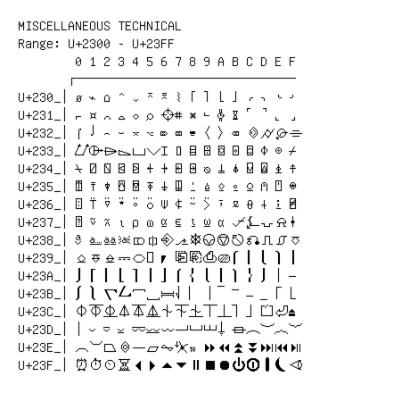

# Miscellaneous Technical

**Range:** `U+2300` - `U+23FF`

[← Back to Index](../README.md)

```text
        0 1 2 3 4 5 6 7 8 9 A B C D E F
       ┌───────────────────────────────
U+230_│⌀ ⌁ ⌂ ⌃ ⌄ ⌅ ⌆ ⌇ ⌈ ⌉ ⌊ ⌋ ⌌ ⌍ ⌎ ⌏
U+231_│⌐ ⌑ ⌒ ⌓ ⌔ ⌕ ⌖ ⌗ ⌘ ⌙ ⌚⌛⌜ ⌝ ⌞ ⌟
U+232_│⌠ ⌡ ⌢ ⌣ ⌤ ⌥ ⌦ ⌧ ⌨ 〈〉⌫ ⌬ ⌭ ⌮ ⌯
U+233_│⌰ ⌱ ⌲ ⌳ ⌴ ⌵ ⌶ ⌷ ⌸ ⌹ ⌺ ⌻ ⌼ ⌽ ⌾ ⌿
U+234_│⍀ ⍁ ⍂ ⍃ ⍄ ⍅ ⍆ ⍇ ⍈ ⍉ ⍊ ⍋ ⍌ ⍍ ⍎ ⍏
U+235_│⍐ ⍑ ⍒ ⍓ ⍔ ⍕ ⍖ ⍗ ⍘ ⍙ ⍚ ⍛ ⍜ ⍝ ⍞ ⍟
U+236_│⍠ ⍡ ⍢ ⍣ ⍤ ⍥ ⍦ ⍧ ⍨ ⍩ ⍪ ⍫ ⍬ ⍭ ⍮ ⍯
U+237_│⍰ ⍱ ⍲ ⍳ ⍴ ⍵ ⍶ ⍷ ⍸ ⍹ ⍺ ⍻ ⍼ ⍽ ⍾ ⍿
U+238_│⎀ ⎁ ⎂ ⎃ ⎄ ⎅ ⎆ ⎇ ⎈ ⎉ ⎊ ⎋ ⎌ ⎍ ⎎ ⎏
U+239_│⎐ ⎑ ⎒ ⎓ ⎔ ⎕ ⎖ ⎗ ⎘ ⎙ ⎚ ⎛ ⎜ ⎝ ⎞ ⎟
U+23A_│⎠ ⎡ ⎢ ⎣ ⎤ ⎥ ⎦ ⎧ ⎨ ⎩ ⎪ ⎫ ⎬ ⎭ ⎮ ⎯
U+23B_│⎰ ⎱ ⎲ ⎳ ⎴ ⎵ ⎶ ⎷ ⎸ ⎹ ⎺ ⎻ ⎼ ⎽ ⎾ ⎿
U+23C_│⏀ ⏁ ⏂ ⏃ ⏄ ⏅ ⏆ ⏇ ⏈ ⏉ ⏊ ⏋ ⏌ ⏍ ⏎ ⏏
U+23D_│⏐ ⏑ ⏒ ⏓ ⏔ ⏕ ⏖ ⏗ ⏘ ⏙ ⏚ ⏛ ⏜ ⏝ ⏞ ⏟
U+23E_│⏠ ⏡ ⏢ ⏣ ⏤ ⏥ ⏦ ⏧ ⏨ ⏩⏪⏫⏬⏭ ⏮ ⏯
U+23F_│⏰⏱ ⏲ ⏳⏴ ⏵ ⏶ ⏷ ⏸ ⏹ ⏺ ⏻ ⏼ ⏽ ⏾ ⏿
```

## Visual Fallback Reference
If your system lacks the required fonts to render these characters properly, use the image below as a visual guide.


