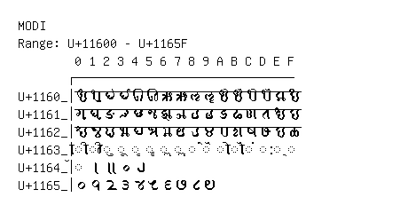

# Modi

**Range:** `U+11600` - `U+1165F`

[← Back to Index](../README.md)

```text
        0 1 2 3 4 5 6 7 8 9 A B C D E F
       ┌───────────────────────────────
U+1160_│𑘀 𑘁 𑘂 𑘃 𑘄 𑘅 𑘆 𑘇 𑘈 𑘉 𑘊 𑘋 𑘌 𑘍 𑘎 𑘏
U+1161_│𑘐 𑘑 𑘒 𑘓 𑘔 𑘕 𑘖 𑘗 𑘘 𑘙 𑘚 𑘛 𑘜 𑘝 𑘞 𑘟
U+1162_│𑘠 𑘡 𑘢 𑘣 𑘤 𑘥 𑘦 𑘧 𑘨 𑘩 𑘪 𑘫 𑘬 𑘭 𑘮 𑘯
U+1163_│◌𑘰 ◌𑘱 ◌𑘲 ◌𑘳 ◌𑘴 ◌𑘵 ◌𑘶 ◌𑘷 ◌𑘸 ◌𑘹 ◌𑘺 ◌𑘻 ◌𑘼 ◌𑘽 ◌𑘾 ◌𑘿
U+1164_│◌𑙀 𑙁 𑙂 𑙃 𑙄
U+1165_│𑙐 𑙑 𑙒 𑙓 𑙔 𑙕 𑙖 𑙗 𑙘 𑙙
```

## Visual Fallback Reference
If your system lacks the required fonts to render these characters properly, use the image below as a visual guide.


