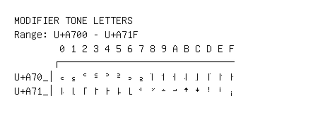

# Modifier Tone Letters

**Range:** `U+A700` - `U+A71F`

[← Back to Index](../README.md)

```text
        0 1 2 3 4 5 6 7 8 9 A B C D E F
       ┌───────────────────────────────
U+A70_│꜀ ꜁ ꜂ ꜃ ꜄ ꜅ ꜆ ꜇ ꜈ ꜉ ꜊ ꜋ ꜌ ꜍ ꜎ ꜏
U+A71_│꜐ ꜑ ꜒ ꜓ ꜔ ꜕ ꜖ ꜗ ꜘ ꜙ ꜚ ꜛ ꜜ ꜝ ꜞ ꜟ
```

## Visual Fallback Reference
If your system lacks the required fonts to render these characters properly, use the image below as a visual guide.


