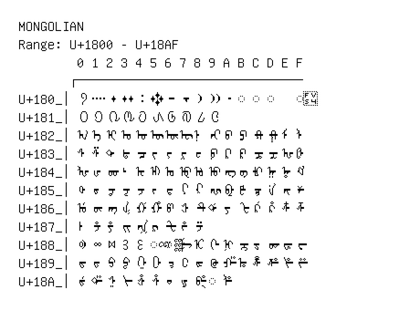

# Mongolian

**Range:** `U+1800` - `U+18AF`

[← Back to Index](../README.md)

```text
        0 1 2 3 4 5 6 7 8 9 A B C D E F
       ┌───────────────────────────────
U+180_│᠀ ᠁ ᠂ ᠃ ᠄ ᠅ ᠆ ᠇ ᠈ ᠉ ᠊ ◌᠋ ◌᠌ ◌᠍   ◌᠏
U+181_│᠐ ᠑ ᠒ ᠓ ᠔ ᠕ ᠖ ᠗ ᠘ ᠙
U+182_│ᠠ ᠡ ᠢ ᠣ ᠤ ᠥ ᠦ ᠧ ᠨ ᠩ ᠪ ᠫ ᠬ ᠭ ᠮ ᠯ
U+183_│ᠰ ᠱ ᠲ ᠳ ᠴ ᠵ ᠶ ᠷ ᠸ ᠹ ᠺ ᠻ ᠼ ᠽ ᠾ ᠿ
U+184_│ᡀ ᡁ ᡂ ᡃ ᡄ ᡅ ᡆ ᡇ ᡈ ᡉ ᡊ ᡋ ᡌ ᡍ ᡎ ᡏ
U+185_│ᡐ ᡑ ᡒ ᡓ ᡔ ᡕ ᡖ ᡗ ᡘ ᡙ ᡚ ᡛ ᡜ ᡝ ᡞ ᡟ
U+186_│ᡠ ᡡ ᡢ ᡣ ᡤ ᡥ ᡦ ᡧ ᡨ ᡩ ᡪ ᡫ ᡬ ᡭ ᡮ ᡯ
U+187_│ᡰ ᡱ ᡲ ᡳ ᡴ ᡵ ᡶ ᡷ ᡸ
U+188_│ᢀ ᢁ ᢂ ᢃ ᢄ ◌ᢅ ◌ᢆ ᢇ ᢈ ᢉ ᢊ ᢋ ᢌ ᢍ ᢎ ᢏ
U+189_│ᢐ ᢑ ᢒ ᢓ ᢔ ᢕ ᢖ ᢗ ᢘ ᢙ ᢚ ᢛ ᢜ ᢝ ᢞ ᢟ
U+18A_│ᢠ ᢡ ᢢ ᢣ ᢤ ᢥ ᢦ ᢧ ᢨ ◌ᢩ ᢪ
```

## Visual Fallback Reference
If your system lacks the required fonts to render these characters properly, use the image below as a visual guide.


