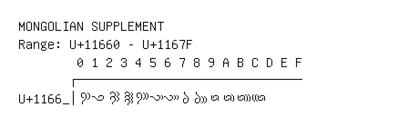

# Mongolian Supplement

**Range:** `U+11660` - `U+1167F`

[← Back to Index](../README.md)

```text
        0 1 2 3 4 5 6 7 8 9 A B C D E F
       ┌───────────────────────────────
U+1166_│𑙠 𑙡 𑙢 𑙣 𑙤 𑙥 𑙦 𑙧 𑙨 𑙩 𑙪 𑙫 𑙬
```

## Visual Fallback Reference
If your system lacks the required fonts to render these characters properly, use the image below as a visual guide.


