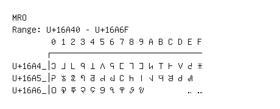

# Mro

**Range:** `U+16A40` - `U+16A6F`

[← Back to Index](../README.md)

```text
        0 1 2 3 4 5 6 7 8 9 A B C D E F
       ┌───────────────────────────────
U+16A4_│𖩀 𖩁 𖩂 𖩃 𖩄 𖩅 𖩆 𖩇 𖩈 𖩉 𖩊 𖩋 𖩌 𖩍 𖩎 𖩏
U+16A5_│𖩐 𖩑 𖩒 𖩓 𖩔 𖩕 𖩖 𖩗 𖩘 𖩙 𖩚 𖩛 𖩜 𖩝 𖩞
U+16A6_│𖩠 𖩡 𖩢 𖩣 𖩤 𖩥 𖩦 𖩧 𖩨 𖩩         𖩮 𖩯
```

## Visual Fallback Reference
If your system lacks the required fonts to render these characters properly, use the image below as a visual guide.


