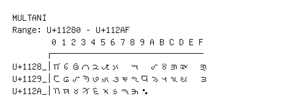

# Multani

**Range:** `U+11280` - `U+112AF`

[← Back to Index](../README.md)

```text
        0 1 2 3 4 5 6 7 8 9 A B C D E F
       ┌───────────────────────────────
U+1128_│𑊀 𑊁 𑊂 𑊃 𑊄 𑊅 𑊆   𑊈   𑊊 𑊋 𑊌 𑊍   𑊏
U+1129_│𑊐 𑊑 𑊒 𑊓 𑊔 𑊕 𑊖 𑊗 𑊘 𑊙 𑊚 𑊛 𑊜 𑊝   𑊟
U+112A_│𑊠 𑊡 𑊢 𑊣 𑊤 𑊥 𑊦 𑊧 𑊨 𑊩
```

## Visual Fallback Reference
If your system lacks the required fonts to render these characters properly, use the image below as a visual guide.


