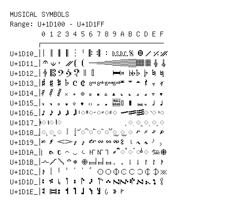

# Musical Symbols

**Range:** `U+1D100` - `U+1D1FF`

[← Back to Index](../README.md)

```text
        0 1 2 3 4 5 6 7 8 9 A B C D E F
       ┌───────────────────────────────
U+1D10_│𝄀 𝄁 𝄂 𝄃 𝄄 𝄅 𝄆 𝄇 𝄈 𝄉 𝄊 𝄋 𝄌 𝄍 𝄎 𝄏
U+1D11_│𝄐 𝄑 𝄒 𝄓 𝄔 𝄕 𝄖 𝄗 𝄘 𝄙 𝄚 𝄛 𝄜 𝄝 𝄞 𝄟
U+1D12_│𝄠 𝄡 𝄢 𝄣 𝄤 𝄥 𝄦     𝄩 𝄪 𝄫 𝄬 𝄭 𝄮 𝄯
U+1D13_│𝄰 𝄱 𝄲 𝄳 𝄴 𝄵 𝄶 𝄷 𝄸 𝄹 𝄺 𝄻 𝄼 𝄽 𝄾 𝄿
U+1D14_│𝅀 𝅁 𝅂 𝅃 𝅄 𝅅 𝅆 𝅇 𝅈 𝅉 𝅊 𝅋 𝅌 𝅍 𝅎 𝅏
U+1D15_│𝅐 𝅑 𝅒 𝅓 𝅔 𝅕 𝅖 𝅗 𝅘 𝅙 𝅚 𝅛 𝅜 𝅝 𝅗𝅥 𝅘𝅥
U+1D16_│𝅘𝅥𝅮 𝅘𝅥𝅯 𝅘𝅥𝅰 𝅘𝅥𝅱 𝅘𝅥𝅲 ◌𝅥 ◌𝅦 ◌𝅧 ◌𝅨 ◌𝅩 𝅪 𝅫 𝅬 ◌𝅭 ◌𝅮 ◌𝅯
U+1D17_│◌𝅰 ◌𝅱 ◌𝅲                 ◌𝅻 ◌𝅼 ◌𝅽 ◌𝅾 ◌𝅿
U+1D18_│◌𝆀 ◌𝆁 ◌𝆂 𝆃 𝆄 ◌𝆅 ◌𝆆 ◌𝆇 ◌𝆈 ◌𝆉 ◌𝆊 ◌𝆋 𝆌 𝆍 𝆎 𝆏
U+1D19_│𝆐 𝆑 𝆒 𝆓 𝆔 𝆕 𝆖 𝆗 𝆘 𝆙 𝆚 𝆛 𝆜 𝆝 𝆞 𝆟
U+1D1A_│𝆠 𝆡 𝆢 𝆣 𝆤 𝆥 𝆦 𝆧 𝆨 𝆩 ◌𝆪 ◌𝆫 ◌𝆬 ◌𝆭 𝆮 𝆯
U+1D1B_│𝆰 𝆱 𝆲 𝆳 𝆴 𝆵 𝆶 𝆷 𝆸 𝆹 𝆺 𝆹𝅥 𝆺𝅥 𝆹𝅥𝅮 𝆺𝅥𝅮 𝆹𝅥𝅯
U+1D1C_│𝆺𝅥𝅯 𝇁 𝇂 𝇃 𝇄 𝇅 𝇆 𝇇 𝇈 𝇉 𝇊 𝇋 𝇌 𝇍 𝇎 𝇏
U+1D1D_│𝇐 𝇑 𝇒 𝇓 𝇔 𝇕 𝇖 𝇗 𝇘 𝇙 𝇚 𝇛 𝇜 𝇝 𝇞 𝇟
U+1D1E_│𝇠 𝇡 𝇢 𝇣 𝇤 𝇥 𝇦 𝇧 𝇨 𝇩 𝇪
```

## Visual Fallback Reference
If your system lacks the required fonts to render these characters properly, use the image below as a visual guide.


