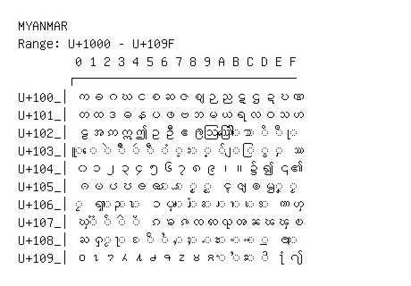

# Myanmar

**Range:** `U+1000` - `U+109F`

[← Back to Index](../README.md)

```text
        0 1 2 3 4 5 6 7 8 9 A B C D E F
       ┌───────────────────────────────
U+100_│က ခ ဂ ဃ င စ ဆ ဇ ဈ ဉ ည ဋ ဌ ဍ ဎ ဏ
U+101_│တ ထ ဒ ဓ န ပ ဖ ဗ ဘ မ ယ ရ လ ဝ သ ဟ
U+102_│ဠ အ ဢ ဣ ဤ ဥ ဦ ဧ ဨ ဩ ဪ ◌ါ ◌ာ ◌ိ ◌ီ ◌ု
U+103_│◌ူ ◌ေ ◌ဲ ◌ဳ ◌ဴ ◌ဵ ◌ံ ◌့ ◌း ◌္ ◌် ◌ျ ◌ြ ◌ွ ◌ှ ဿ
U+104_│၀ ၁ ၂ ၃ ၄ ၅ ၆ ၇ ၈ ၉ ၊ ။ ၌ ၍ ၎ ၏
U+105_│ၐ ၑ ၒ ၓ ၔ ၕ ◌ၖ ◌ၗ ◌ၘ ◌ၙ ၚ ၛ ၜ ၝ ◌ၞ ◌ၟ
U+106_│◌ၠ ၡ ◌ၢ ◌ၣ ◌ၤ ၥ ၦ ◌ၧ ◌ၨ ◌ၩ ◌ၪ ◌ၫ ◌ၬ ◌ၭ ၮ ၯ
U+107_│ၰ ◌ၱ ◌ၲ ◌ၳ ◌ၴ ၵ ၶ ၷ ၸ ၹ ၺ ၻ ၼ ၽ ၾ ၿ
U+108_│ႀ ႁ ◌ႂ ◌ႃ ◌ႄ ◌ႅ ◌ႆ ◌ႇ ◌ႈ ◌ႉ ◌ႊ ◌ႋ ◌ႌ ◌ႍ ႎ ◌ႏ
U+109_│႐ ႑ ႒ ႓ ႔ ႕ ႖ ႗ ႘ ႙ ◌ႚ ◌ႛ ◌ႜ ◌ႝ ႞ ႟
```

## Visual Fallback Reference
If your system lacks the required fonts to render these characters properly, use the image below as a visual guide.


