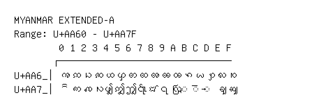

# Myanmar Extended-A

**Range:** `U+AA60` - `U+AA7F`

[← Back to Index](../README.md)

```text
        0 1 2 3 4 5 6 7 8 9 A B C D E F
       ┌───────────────────────────────
U+AA6_│ꩠ ꩡ ꩢ ꩣ ꩤ ꩥ ꩦ ꩧ ꩨ ꩩ ꩪ ꩫ ꩬ ꩭ ꩮ ꩯ
U+AA7_│ꩰ ꩱ ꩲ ꩳ ꩴ ꩵ ꩶ ꩷ ꩸ ꩹ ꩺ ◌ꩻ ◌ꩼ ◌ꩽ ꩾ ꩿ
```

## Visual Fallback Reference
If your system lacks the required fonts to render these characters properly, use the image below as a visual guide.


