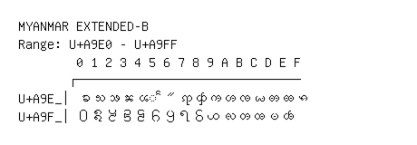

# Myanmar Extended-B

**Range:** `U+A9E0` - `U+A9FF`

[← Back to Index](../README.md)

```text
        0 1 2 3 4 5 6 7 8 9 A B C D E F
       ┌───────────────────────────────
U+A9E_│ꧠ ꧡ ꧢ ꧣ ꧤ ◌ꧥ ꧦ ꧧ ꧨ ꧩ ꧪ ꧫ ꧬ ꧭ ꧮ ꧯ
U+A9F_│꧰ ꧱ ꧲ ꧳ ꧴ ꧵ ꧶ ꧷ ꧸ ꧹ ꧺ ꧻ ꧼ ꧽ ꧾ
```

## Visual Fallback Reference
If your system lacks the required fonts to render these characters properly, use the image below as a visual guide.


