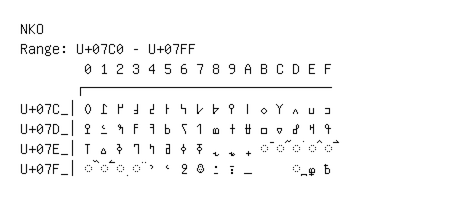

# NKo

**Range:** `U+07C0` - `U+07FF`

[← Back to Index](../README.md)

```text
        0 1 2 3 4 5 6 7 8 9 A B C D E F
       ┌───────────────────────────────
U+07C_│߀ ߁ ߂ ߃ ߄ ߅ ߆ ߇ ߈ ߉ ߊ ߋ ߌ ߍ ߎ ߏ
U+07D_│ߐ ߑ ߒ ߓ ߔ ߕ ߖ ߗ ߘ ߙ ߚ ߛ ߜ ߝ ߞ ߟ
U+07E_│ߠ ߡ ߢ ߣ ߤ ߥ ߦ ߧ ߨ ߩ ߪ ◌߫ ◌߬ ◌߭ ◌߮ ◌߯
U+07F_│◌߰ ◌߱ ◌߲ ◌߳ ߴ ߵ ߶ ߷ ߸ ߹ ߺ     ◌߽ ߾ ߿
```

## Visual Fallback Reference
If your system lacks the required fonts to render these characters properly, use the image below as a visual guide.


