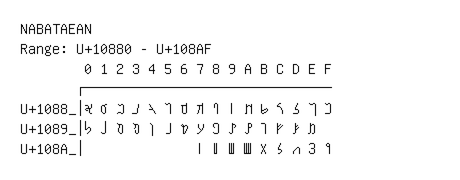

# Nabataean

**Range:** `U+10880` - `U+108AF`

[← Back to Index](../README.md)

```text
        0 1 2 3 4 5 6 7 8 9 A B C D E F
       ┌───────────────────────────────
U+1088_│𐢀 𐢁 𐢂 𐢃 𐢄 𐢅 𐢆 𐢇 𐢈 𐢉 𐢊 𐢋 𐢌 𐢍 𐢎 𐢏
U+1089_│𐢐 𐢑 𐢒 𐢓 𐢔 𐢕 𐢖 𐢗 𐢘 𐢙 𐢚 𐢛 𐢜 𐢝 𐢞
U+108A_│              𐢧 𐢨 𐢩 𐢪 𐢫 𐢬 𐢭 𐢮 𐢯
```

## Visual Fallback Reference
If your system lacks the required fonts to render these characters properly, use the image below as a visual guide.


