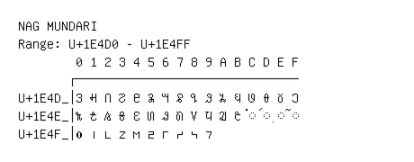

# Nag Mundari

**Range:** `U+1E4D0` - `U+1E4FF`

[← Back to Index](../README.md)

```text
        0 1 2 3 4 5 6 7 8 9 A B C D E F
       ┌───────────────────────────────
U+1E4D_│𞓐 𞓑 𞓒 𞓓 𞓔 𞓕 𞓖 𞓗 𞓘 𞓙 𞓚 𞓛 𞓜 𞓝 𞓞 𞓟
U+1E4E_│𞓠 𞓡 𞓢 𞓣 𞓤 𞓥 𞓦 𞓧 𞓨 𞓩 𞓪 𞓫 ◌𞓬 ◌𞓭 ◌𞓮 ◌𞓯
U+1E4F_│𞓰 𞓱 𞓲 𞓳 𞓴 𞓵 𞓶 𞓷 𞓸 𞓹
```

## Visual Fallback Reference
If your system lacks the required fonts to render these characters properly, use the image below as a visual guide.


