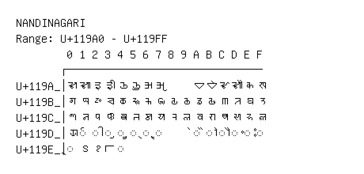

# Nandinagari

**Range:** `U+119A0` - `U+119FF`

[← Back to Index](../README.md)

```text
        0 1 2 3 4 5 6 7 8 9 A B C D E F
       ┌───────────────────────────────
U+119A_│𑦠 𑦡 𑦢 𑦣 𑦤 𑦥 𑦦 𑦧     𑦪 𑦫 𑦬 𑦭 𑦮 𑦯
U+119B_│𑦰 𑦱 𑦲 𑦳 𑦴 𑦵 𑦶 𑦷 𑦸 𑦹 𑦺 𑦻 𑦼 𑦽 𑦾 𑦿
U+119C_│𑧀 𑧁 𑧂 𑧃 𑧄 𑧅 𑧆 𑧇 𑧈 𑧉 𑧊 𑧋 𑧌 𑧍 𑧎 𑧏
U+119D_│𑧐 ◌𑧑 ◌𑧒 ◌𑧓 ◌𑧔 ◌𑧕 ◌𑧖 ◌𑧗     ◌𑧚 ◌𑧛 ◌𑧜 ◌𑧝 ◌𑧞 ◌𑧟
U+119E_│◌𑧠 𑧡 𑧢 𑧣 ◌𑧤
```

## Visual Fallback Reference
If your system lacks the required fonts to render these characters properly, use the image below as a visual guide.


