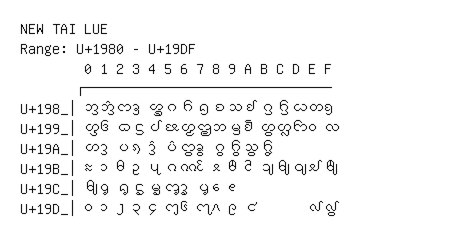

# New Tai Lue

**Range:** `U+1980` - `U+19DF`

[← Back to Index](../README.md)

```text
        0 1 2 3 4 5 6 7 8 9 A B C D E F
       ┌───────────────────────────────
U+198_│ᦀ ᦁ ᦂ ᦃ ᦄ ᦅ ᦆ ᦇ ᦈ ᦉ ᦊ ᦋ ᦌ ᦍ ᦎ ᦏ
U+199_│ᦐ ᦑ ᦒ ᦓ ᦔ ᦕ ᦖ ᦗ ᦘ ᦙ ᦚ ᦛ ᦜ ᦝ ᦞ ᦟ
U+19A_│ᦠ ᦡ ᦢ ᦣ ᦤ ᦥ ᦦ ᦧ ᦨ ᦩ ᦪ ᦫ
U+19B_│ᦰ ᦱ ᦲ ᦳ ᦴ ᦵ ᦶ ᦷ ᦸ ᦹ ᦺ ᦻ ᦼ ᦽ ᦾ ᦿ
U+19C_│ᧀ ᧁ ᧂ ᧃ ᧄ ᧅ ᧆ ᧇ ᧈ ᧉ
U+19D_│᧐ ᧑ ᧒ ᧓ ᧔ ᧕ ᧖ ᧗ ᧘ ᧙ ᧚       ᧞ ᧟
```

## Visual Fallback Reference
If your system lacks the required fonts to render these characters properly, use the image below as a visual guide.


