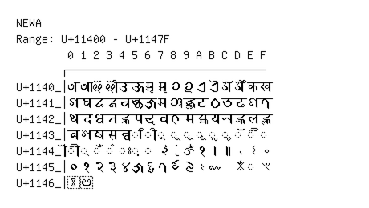

# Newa

**Range:** `U+11400` - `U+1147F`

[← Back to Index](../README.md)

```text
        0 1 2 3 4 5 6 7 8 9 A B C D E F
       ┌───────────────────────────────
U+1140_│𑐀 𑐁 𑐂 𑐃 𑐄 𑐅 𑐆 𑐇 𑐈 𑐉 𑐊 𑐋 𑐌 𑐍 𑐎 𑐏
U+1141_│𑐐 𑐑 𑐒 𑐓 𑐔 𑐕 𑐖 𑐗 𑐘 𑐙 𑐚 𑐛 𑐜 𑐝 𑐞 𑐟
U+1142_│𑐠 𑐡 𑐢 𑐣 𑐤 𑐥 𑐦 𑐧 𑐨 𑐩 𑐪 𑐫 𑐬 𑐭 𑐮 𑐯
U+1143_│𑐰 𑐱 𑐲 𑐳 𑐴 ◌𑐵 ◌𑐶 ◌𑐷 ◌𑐸 ◌𑐹 ◌𑐺 ◌𑐻 ◌𑐼 ◌𑐽 ◌𑐾 ◌𑐿
U+1144_│◌𑑀 ◌𑑁 ◌𑑂 ◌𑑃 ◌𑑄 ◌𑑅 ◌𑑆 𑑇 𑑈 𑑉 𑑊 𑑋 𑑌 𑑍 𑑎 𑑏
U+1145_│𑑐 𑑑 𑑒 𑑓 𑑔 𑑕 𑑖 𑑗 𑑘 𑑙 𑑚 𑑛   𑑝 ◌𑑞 𑑟
U+1146_│𑑠 𑑡
```

## Visual Fallback Reference
If your system lacks the required fonts to render these characters properly, use the image below as a visual guide.


