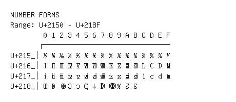

# Number Forms

**Range:** `U+2150` - `U+218F`

[← Back to Index](../README.md)

```text
        0 1 2 3 4 5 6 7 8 9 A B C D E F
       ┌───────────────────────────────
U+215_│⅐ ⅑ ⅒ ⅓ ⅔ ⅕ ⅖ ⅗ ⅘ ⅙ ⅚ ⅛ ⅜ ⅝ ⅞ ⅟
U+216_│Ⅰ Ⅱ Ⅲ Ⅳ Ⅴ Ⅵ Ⅶ Ⅷ Ⅸ Ⅹ Ⅺ Ⅻ Ⅼ Ⅽ Ⅾ Ⅿ
U+217_│ⅰ ⅱ ⅲ ⅳ ⅴ ⅵ ⅶ ⅷ ⅸ ⅹ ⅺ ⅻ ⅼ ⅽ ⅾ ⅿ
U+218_│ↀ ↁ ↂ Ↄ ↄ ↅ ↆ ↇ ↈ ↉ ↊ ↋
```

## Visual Fallback Reference
If your system lacks the required fonts to render these characters properly, use the image below as a visual guide.


