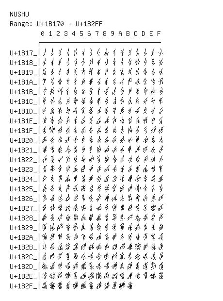

# Nushu

**Range:** `U+1B170` - `U+1B2FF`

[← Back to Index](../README.md)

```text
        0 1 2 3 4 5 6 7 8 9 A B C D E F
       ┌───────────────────────────────
U+1B17_│𛅰𛅱𛅲𛅳𛅴𛅵𛅶𛅷𛅸𛅹𛅺𛅻𛅼𛅽𛅾𛅿
U+1B18_│𛆀𛆁𛆂𛆃𛆄𛆅𛆆𛆇𛆈𛆉𛆊𛆋𛆌𛆍𛆎𛆏
U+1B19_│𛆐𛆑𛆒𛆓𛆔𛆕𛆖𛆗𛆘𛆙𛆚𛆛𛆜𛆝𛆞𛆟
U+1B1A_│𛆠𛆡𛆢𛆣𛆤𛆥𛆦𛆧𛆨𛆩𛆪𛆫𛆬𛆭𛆮𛆯
U+1B1B_│𛆰𛆱𛆲𛆳𛆴𛆵𛆶𛆷𛆸𛆹𛆺𛆻𛆼𛆽𛆾𛆿
U+1B1C_│𛇀𛇁𛇂𛇃𛇄𛇅𛇆𛇇𛇈𛇉𛇊𛇋𛇌𛇍𛇎𛇏
U+1B1D_│𛇐𛇑𛇒𛇓𛇔𛇕𛇖𛇗𛇘𛇙𛇚𛇛𛇜𛇝𛇞𛇟
U+1B1E_│𛇠𛇡𛇢𛇣𛇤𛇥𛇦𛇧𛇨𛇩𛇪𛇫𛇬𛇭𛇮𛇯
U+1B1F_│𛇰𛇱𛇲𛇳𛇴𛇵𛇶𛇷𛇸𛇹𛇺𛇻𛇼𛇽𛇾𛇿
U+1B20_│𛈀𛈁𛈂𛈃𛈄𛈅𛈆𛈇𛈈𛈉𛈊𛈋𛈌𛈍𛈎𛈏
U+1B21_│𛈐𛈑𛈒𛈓𛈔𛈕𛈖𛈗𛈘𛈙𛈚𛈛𛈜𛈝𛈞𛈟
U+1B22_│𛈠𛈡𛈢𛈣𛈤𛈥𛈦𛈧𛈨𛈩𛈪𛈫𛈬𛈭𛈮𛈯
U+1B23_│𛈰𛈱𛈲𛈳𛈴𛈵𛈶𛈷𛈸𛈹𛈺𛈻𛈼𛈽𛈾𛈿
U+1B24_│𛉀𛉁𛉂𛉃𛉄𛉅𛉆𛉇𛉈𛉉𛉊𛉋𛉌𛉍𛉎𛉏
U+1B25_│𛉐𛉑𛉒𛉓𛉔𛉕𛉖𛉗𛉘𛉙𛉚𛉛𛉜𛉝𛉞𛉟
U+1B26_│𛉠𛉡𛉢𛉣𛉤𛉥𛉦𛉧𛉨𛉩𛉪𛉫𛉬𛉭𛉮𛉯
U+1B27_│𛉰𛉱𛉲𛉳𛉴𛉵𛉶𛉷𛉸𛉹𛉺𛉻𛉼𛉽𛉾𛉿
U+1B28_│𛊀𛊁𛊂𛊃𛊄𛊅𛊆𛊇𛊈𛊉𛊊𛊋𛊌𛊍𛊎𛊏
U+1B29_│𛊐𛊑𛊒𛊓𛊔𛊕𛊖𛊗𛊘𛊙𛊚𛊛𛊜𛊝𛊞𛊟
U+1B2A_│𛊠𛊡𛊢𛊣𛊤𛊥𛊦𛊧𛊨𛊩𛊪𛊫𛊬𛊭𛊮𛊯
U+1B2B_│𛊰𛊱𛊲𛊳𛊴𛊵𛊶𛊷𛊸𛊹𛊺𛊻𛊼𛊽𛊾𛊿
U+1B2C_│𛋀𛋁𛋂𛋃𛋄𛋅𛋆𛋇𛋈𛋉𛋊𛋋𛋌𛋍𛋎𛋏
U+1B2D_│𛋐𛋑𛋒𛋓𛋔𛋕𛋖𛋗𛋘𛋙𛋚𛋛𛋜𛋝𛋞𛋟
U+1B2E_│𛋠𛋡𛋢𛋣𛋤𛋥𛋦𛋧𛋨𛋩𛋪𛋫𛋬𛋭𛋮𛋯
U+1B2F_│𛋰𛋱𛋲𛋳𛋴𛋵𛋶𛋷𛋸𛋹𛋺𛋻
```

## Visual Fallback Reference
If your system lacks the required fonts to render these characters properly, use the image below as a visual guide.


